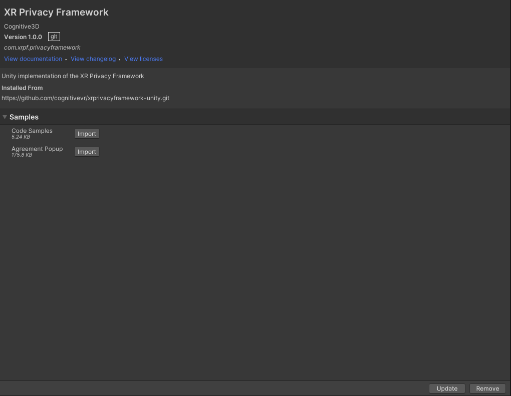
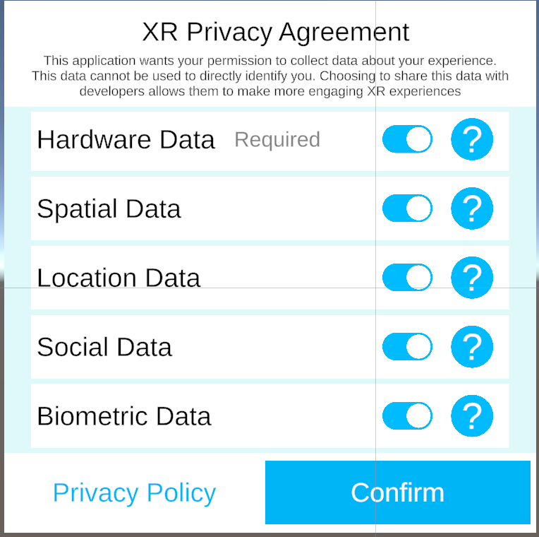
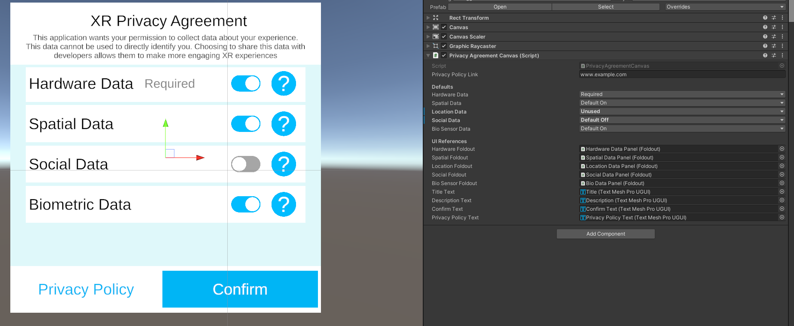
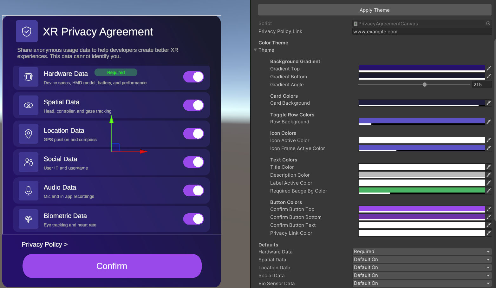

# The XR Privacy Framework for Unity

The [XR Privacy Framework](https://xrprivacyframework.org) (XRPF) is for app developers to inform their users about the data they collect. The intention is to allow users to control what data is recorded for analytics / advertising / machine learning purposes while still engaging with fully featured XR experiences.

**This package requires Unity 2021.3.45f1 or newer**

## Installation

* Open Package Manager from the Window menu
* Click the '+' in the top left and select 'Add Package from git URL'
* Input `https://github.com/cognitivevr/xrprivacyframework-unity.git`

## Samples

We have two samples in the package. You can install them from the package manager, as shown below.



### Popup Sample

There is a sample world-space canvas prefab ("AgreementCanvas") that can be instantiated at runtime. This provides a configurable description of all the different types of data the application may record. It also includes a configurable link to your privacy policy. This may need to be customized to handle UI inputs with your chosen platform.

It depends on the TextMeshPro package.



The popup prefab has some settings you can modify in the inspector.

`Privacy Policy Link` : Enter the URL to launch when user clicks the Privacy Policy button

Each data type also has the following settings that dictate how the Agreement Canvas will be presented.

`Required`: User cannot opt out of this
`Default On`: The toggle button will be in the "enabled" position by default
`Default Off`: The toggle button will be in the "disabled" position by default
`Unused`: This data type won't be displayed



### Customization

The agreement prefab UI can be styled through the Color Theme section of the Privacy Agreement Canvas component. Background, card, and button colors are fully configurable to match your application's design system.



### Code Sample

The core code is designed for app developers to quickly implement. In most cases, displaying the Popup Sample will be sufficient. Tools developers (eg analytics/advertising/machine learning companies) will be responsible for respecting the user's privacy choices.

```csharp
//creates a new agreement from the user's choices
XRPF.PrivacyFramework.SetNewAgreement(allowHardwareData: true, allowSpatialData: true, allowLocationData: true, allowSocialData: true, allowBioData: true, allowAudioData: true);

//check if the user's agreement allows social data to be recorded
//other data sources have their own properties
if (XRPF.PrivacyFramework.Agreement.IsSocialDataAllowed) { /* do something */ }

//called after a privacy policy is set or changed by the user
XRPF.PrivacyFramework.OnPrivacyAgreementChanged += PrivacyFramework_OnPrivacyAgreementChanged;
```
